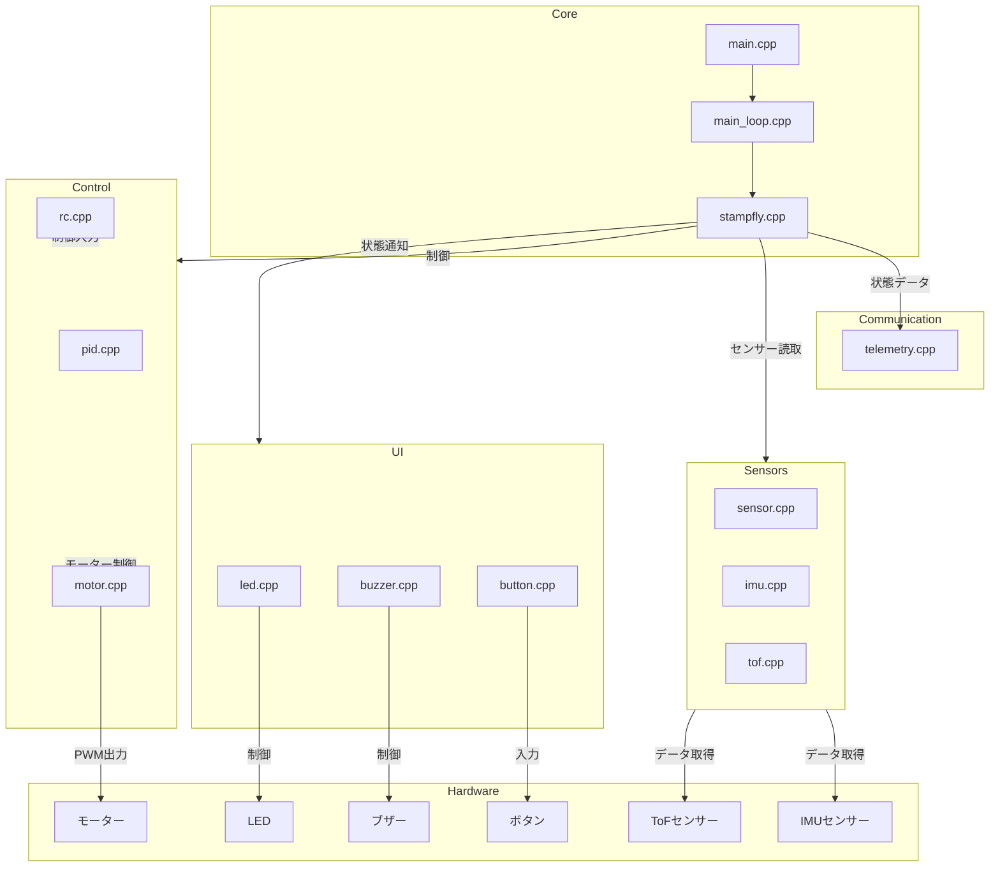

# アーキテクチャ設計

## システム構成



## ソースコードの構造

### コアモジュール
- `main.cpp`: エントリーポイント
- `main_loop.cpp`: 400Hz制御ループ
- `stampfly.cpp`: メインの制御ロジック

### センサー制御
- `sensor.cpp`: センサー統合管理
- `imu.cpp`: IMUセンサー制御
- `tof.cpp`: ToFセンサー制御

### 制御系
- `pid.cpp`: PID制御実装
- `motor.cpp`: モーター制御
- `rc.cpp`: リモートコントロール

### UI/フィードバック
- `led.cpp`: LED制御
- `buzzer.cpp`: ブザー制御
- `button.cpp`: ボタン制御

### 通信
- `telemetry.cpp`: テレメトリー通信

## データフロー

```mermaid
sequenceDiagram
    participant Main
    participant Loop
    participant Sensors
    participant Control
    participant Motors
    participant UI
    participant Telemetry

    Main->>Loop: システム初期化
    Main->>Sensors: センサー初期化
    Main->>Control: 制御系初期化
    Main->>Motors: モーター初期化
    Main->>UI: UI初期化
    Main->>Telemetry: 通信初期化

    loop 400Hz周期
        Loop->>Sensors: IMU/ToFデータ要求
        Sensors-->>Loop: センサーデータ
        Loop->>Control: 姿勢/高度データ
        Control->>Control: PID制御計算
        Control->>Motors: モーター出力設定
        Loop->>UI: 状態更新
        UI-->>Loop: ユーザー入力
        Loop->>Telemetry: テレメトリーデータ
        Telemetry-->>Loop: 通信状態
    end
```

## 主要コンポーネントの責務

### メインループ (main_loop.cpp)
- 400Hz周期での制御実行
- センサーデータの取得
- 制御計算の実行
- モーター出力の設定
- テレメトリーデータの送信

### センサー管理 (sensor.cpp)
- 各種センサーの初期化
- データ取得のタイミング管理
- センサーデータの前処理
- 異常検知

### 制御系 (pid.cpp)
- PIDパラメータの管理
- 制御計算の実装
- 安定化制御
- フェールセーフ処理

### モーター制御 (motor.cpp)
- PWM出力の制御
- モーター回転数の管理
- 推力制御
- 安全機能

### テレメトリー (telemetry.cpp)
- データのパケット化
- 通信プロトコル管理
- エラー処理
- ログ記録
