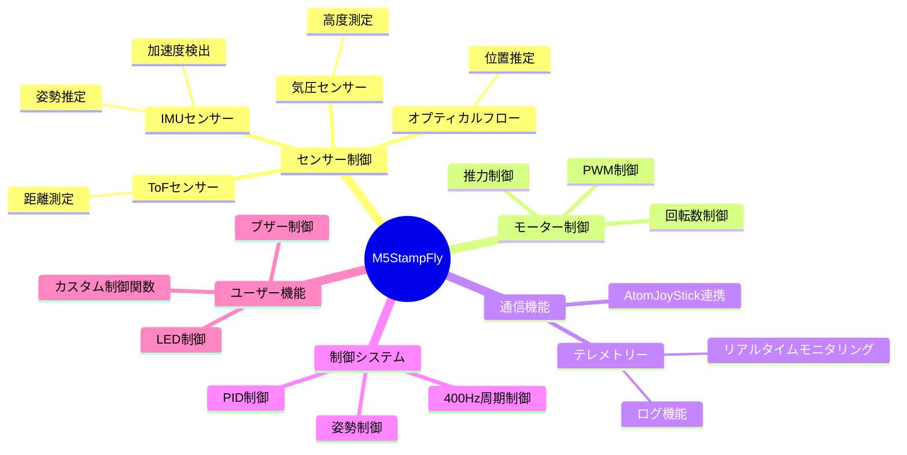

# 要件定義

## プロジェクトの目的

M5StampFlyのファームウェア開発のための基盤となるスケルトンコードを提供し、ユーザーが独自の飛行制御プログラムを容易に開発できるようにすること。

## 機能要件

## 非機能要件

### パフォーマンス要件
- 制御周期: 400Hz
- センサーデータ取得の低遅延化
- リアルタイム性の確保

### 信頼性要件
- フェールセーフ機能
- バッテリー残量監視
- 異常検知と安全着陸

### 拡張性要件
- ユーザーによる機能拡張が容易
- モジュール化された設計
- 明確なAPIの提供

## 制約条件

### ハードウェア制約
- M5StampS3（ESP32-S3）
- 300mAhバッテリー
- 各種センサーの制限事項

### ソフトウェア制約
- PlatformIO環境
- ESP-IDF フレームワーク
- リアルタイムOS要件
